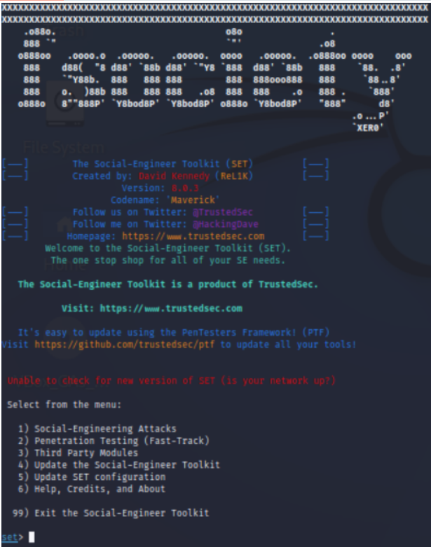
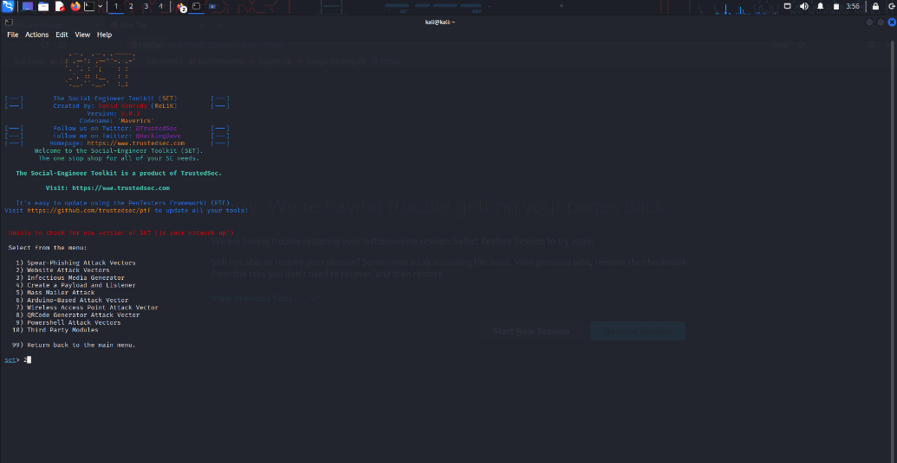
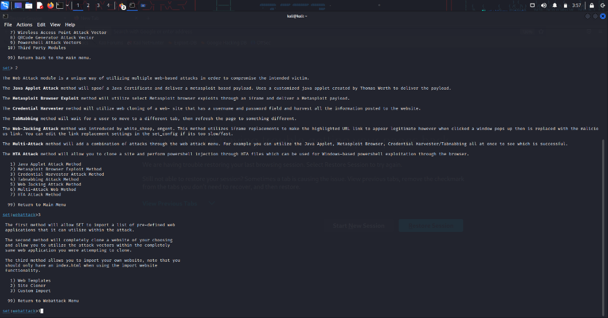
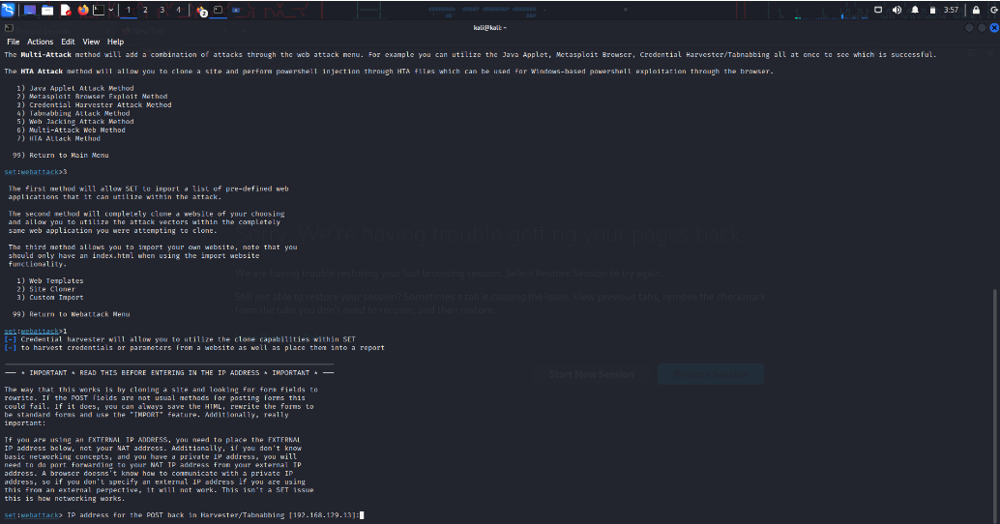
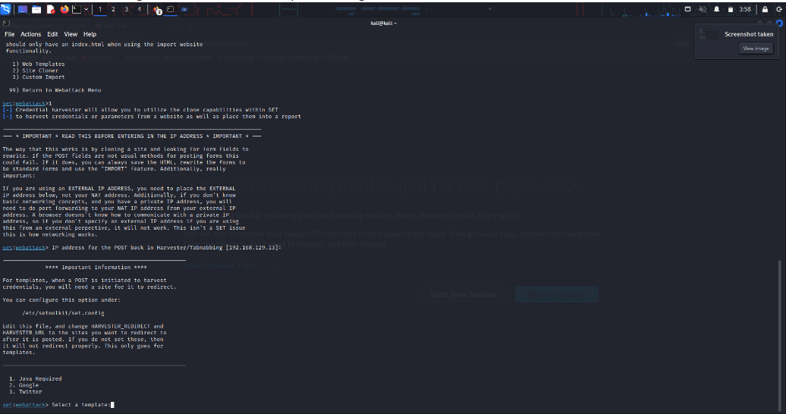
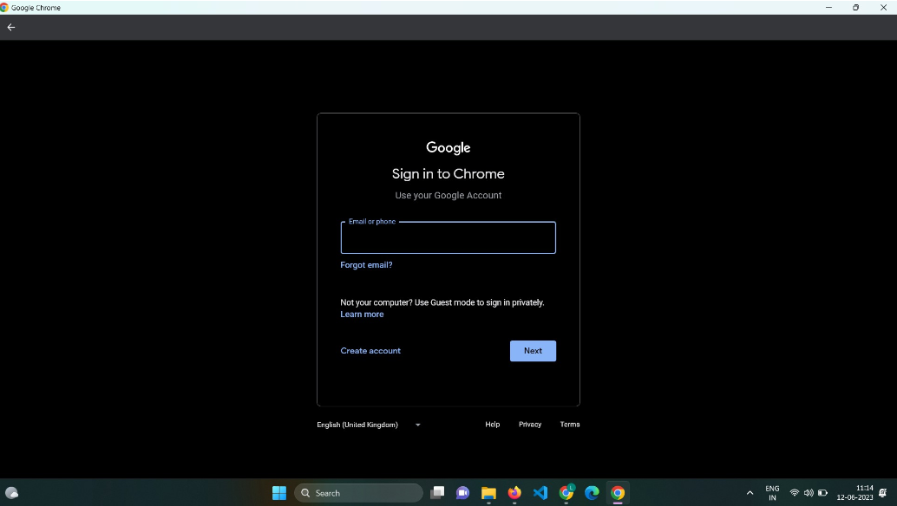
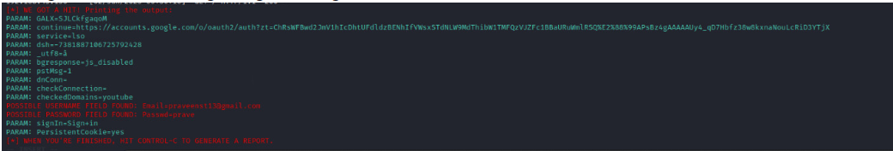
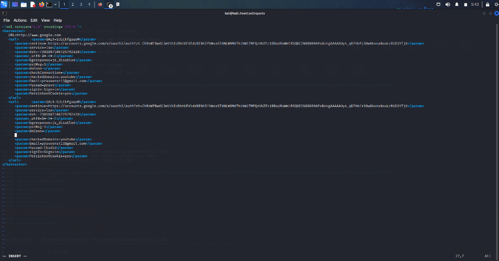

# creating-a-backdoor-with-SET
creating a backdoor with SET - Ethical Hacking Techniques course

# AIM:
To Create a backdoor with Social Engineering Toolkit (SET)

## DESIGN STEPS:

### Step 1:

Install kali linux either in partition or virtual box or in live mode

### Step 2:

Investigate on the various categories of tools as follows:

### Step 3:

Open terminal and try execute some kali linux commands

## EXECUTION STEPS AND ITS OUTPUT:
### Social Engineering attacks are the various cons used by the hackers to trick people into providing sensitive data to the attackers. The command sudo setoolkit in the prompt gives menu with set prompt:

### It displays the following menu and select 2 for Website Attack Vectors:

### The website Attack Vectors displays the following menu. In this menu3 for Credential Harvester Attack Method is selected:

### The Credential Harvester Attack Method displays the following menu. In this menu1 for Web Templates is selected:

### It shows the following screen in which the ip address of the attacker need to be given which is the default value:

### It shows the following screen in which the option Google can be selected:

### SET starts my Kali Linux Webserver on port 80, with the fake Google account login page. The setup is done:

### In windows IE, on giving the url http://192.168.1.2, the fake Google page is displayed. The victim can enter the username and password

### SET logs the information regarding the Google credentials:

### SET logs the information in the xml file under /root/.set directory:

## RESULT:
The Social Engineering Toolkit (SET) is used to create backdoor is  examined successfully
